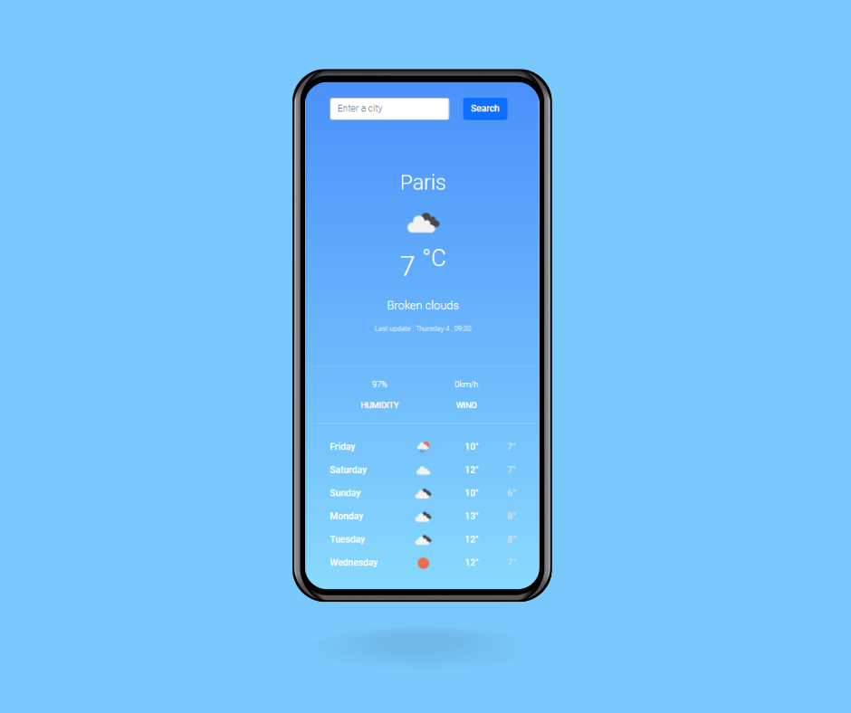

# Weather App

This Weather app is the final project of my Shecodes Plus course dedicated to Advanced HTML, CSS, responsive design and Javascript

It is an interactive application that allows to a user to perform a search according to a city name, the matching data is retrieved through an Axios call to the OpenWeatherMap API and displayed in the User Interface

## Stack

- HTML
- Bootstrap
- SASS

## Screenshot

